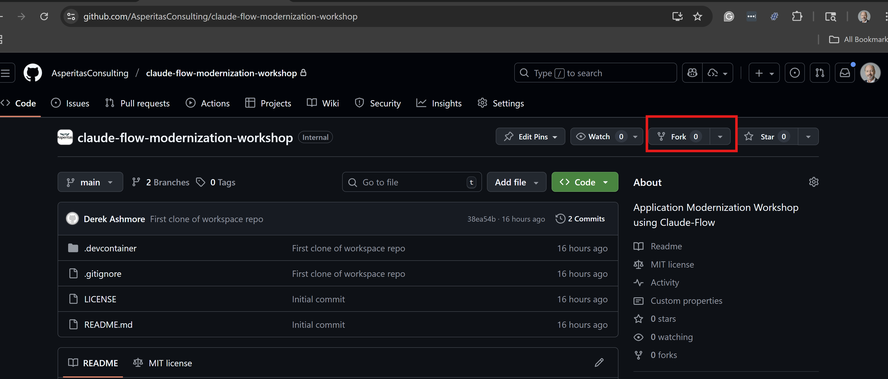
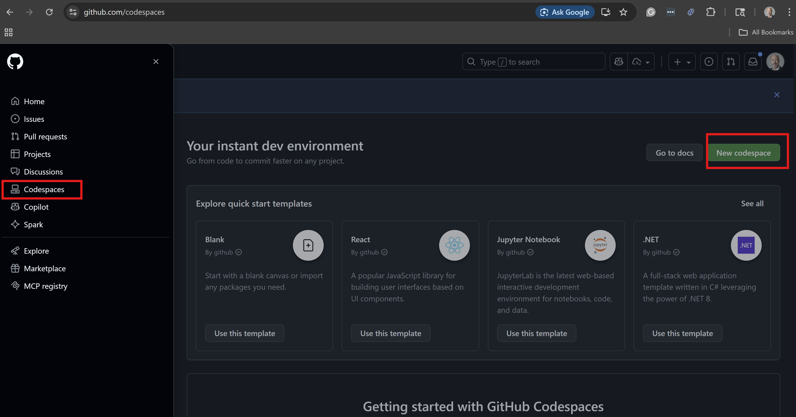
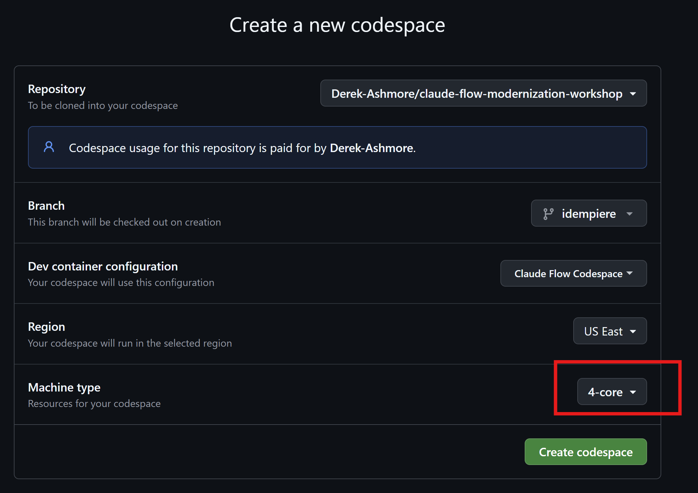
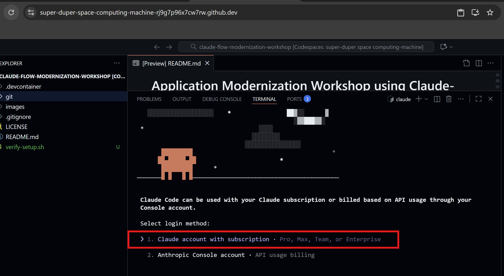
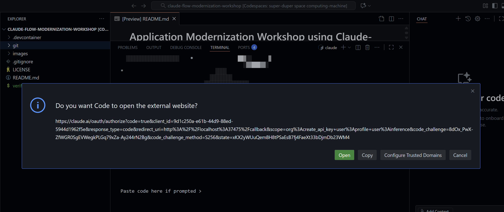
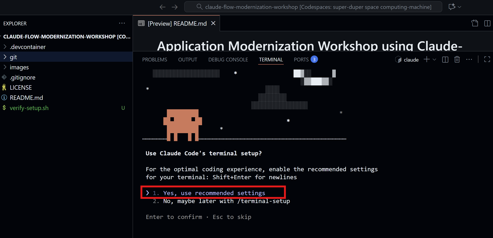
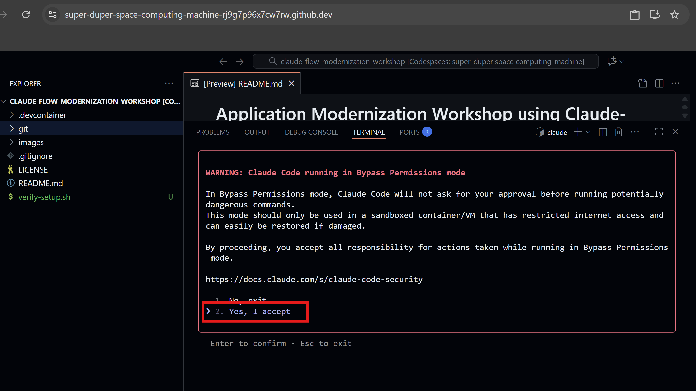

# Application Modernization Workshop using Claude-Flow

## Installation steps

> Step 1: Fork this repository
Fork this GitHub repository so that you can best run it as a codespace in your own account.




> Step 2: Create your GitHub Codespace
Create and start your own Codespace. These instructions guide you through using your codespace from a browser. While these instructions don't use the GitHub CLI, that is an option if you prefer.



Note that the default of 2 cores is a little underpowered for Claude-Flow. While it will work, things take a bit longer.

Also, use the ```main``` branch.  I'm using a feature branch as I'm still writing these instructions.




> Step 3: Install Claude Code in your workspace
Execute the command below in the Terminal window of your Codespace. Claude Code will prompt you for a log in. Follow instructions for a 

```
curl -fsSL https://claude.ai/install.sh | bash
```

> Step 4: Configure Claude Code
We accept Claude-Flow's instructions on permissions requirements.

```
claude --dangerously-skip-permissions
```

As a response to this command, you'll be asked to login to Claude code. You need a "Pro" or "Max" plan for this workshop. Choosing the "Claude Account with Subscription" option is recommended as it allows the Claude Code GUI to be used. I find this more useful if my tea wants to communicate with me. You can use an API key, but then you need to use a headless mode that spits out unreadable JSON-formatted data to you. With that format, it's much harder for the team to communcate with you.



You will be prompted to log into Claude. I usually have better luck copying the URL and posting it in a separate tab. 



Claude will ask you to confirm the recommended terminatl display settings.



Claude will ask you to re-confirm the option to skip permissions.  It's in your best interest to do so at this point, despite the ominous warning.



> Step 5: Configure Claude Code
```
npm install claude-flow@latest --init
claude-flow --version
```
